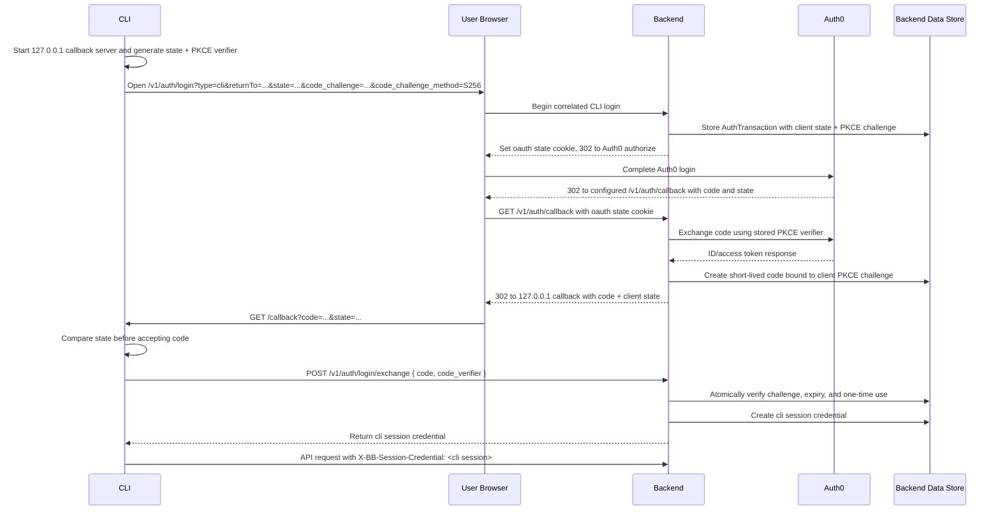

# BuilderBot Auth Flow

This is the intended browser-mediated CLI login flow. Web and CLI can use the same backend Auth0 login path, but the resulting credentials are typed and presented differently.

Security constraints:

- Web sessions are returned as secure cookies and accepted only as cookies.
- CLI sessions are returned by the exchange endpoint and accepted only via the `X-BB-Session-Credential` header.
- Durable session credentials are never placed in redirect URLs.
- The localhost redirect carries only a short-lived, single-use exchange code.
- The loopback callback accepts only `GET` requests to the exact callback path.
- Every CLI attempt uses independent high-entropy state and PKCE S256 material.
- Missing, malformed, wrong, stale, replayed, and cross-attempt callbacks are rejected without stopping the valid listener.
- The verifier is sent only to the exchange endpoint and is cleared with the attempt on success, failure, or cancellation.
- CLI `returnTo` targets must be `http://127.0.0.1:<port>` URLs without userinfo, query, or fragment.
