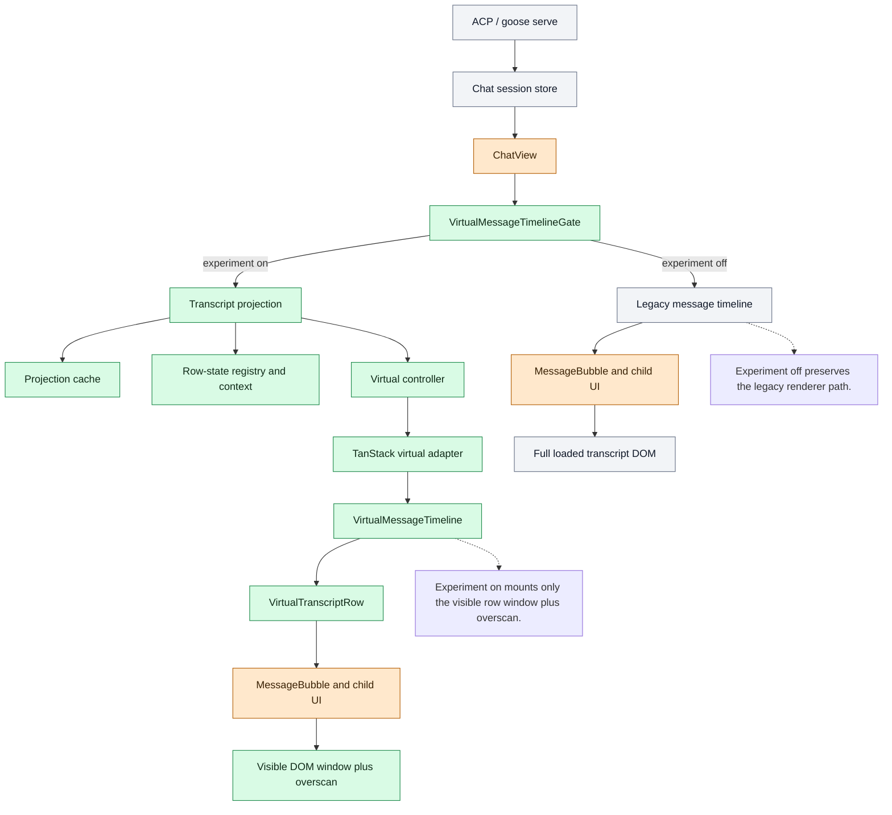
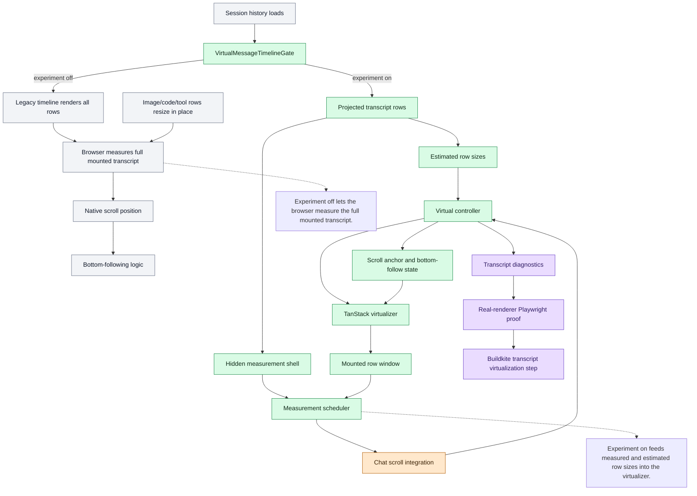

# Transcript Virtualization Roadmap

This PR adds an opt-in virtual transcript renderer for Berd chat. It is a
display-layer change: Berd still loads the full session history, but the chat UI
only mounts the transcript rows needed around the current scroll window.

The purpose of the experiment is to make already-loaded long conversations
cheaper to render and smoother to scroll while preserving the existing Berd chat
UI: message spacing, tool cards, MCP app views, reasoning blocks, code blocks,
images, selected text behavior, and bottom-following behavior.

## Included In This PR

- A transcript projection layer that turns Berd chat content into stable virtual
  rows.
- A TanStack-based virtual timeline that mounts only the visible row window plus
  overscan.
- Row-state preservation for interactive transcript content that may unmount and
  remount while scrolling.
- Dynamic measurement and scroll anchoring for variable-height transcript rows.
- Visual parity coverage for experiment-on and experiment-off spacing across
  desktop and compact transcript widths.
- Browser validation for long transcripts, dynamic rows, MCP/tool UI,
  media/code rows, and the Nexus PR #928 anchoring case.

## Architecture Diagrams

Color in the experiment diagrams:

- Green: new virtual transcript architecture added by this PR.
- Orange: existing chat integration points changed by this PR.
- Purple: new validation and CI coverage added by this PR.

### Rendering Pipeline

### Measurement And Scrolling

## Not Yet Nexus Parity

The experiment is not complete Nexus-style chat virtualization yet. The biggest
remaining gap is that Berd still restores the entire session into memory before
rendering. Nexus-like behavior requires coordinating the renderer with transcript
loading, pagination, and message granularity so large sessions do not need to be
fully present in the renderer before the user can interact with them.

This PR also keeps the virtual renderer default-off while the remaining product
and performance contracts are hardened.

## Path To Nexus Parity

1. Add incremental transcript loading.
   Berd should be able to open a large session by loading the newest useful
   window first, then fetch older history on demand as the user scrolls upward.
   Scroll position must remain anchored when older content is prepended.

2. Split very large assistant output into smaller renderable units.
   A single huge assistant response should not behave as one enormous DOM row.
   The projection layer should support stable fragments so measurement, mounting,
   copying, and scrolling remain responsive during large generated outputs.

3. Expand offscreen measurement.
   Dynamic rows should be measurable before they enter the visible viewport when
   practical, using technologies already present in this PR: the projection
   layer, row measurement scheduler, hidden measurement shell, and TanStack size
   updates.

4. Preserve user-facing transcript contracts while rows load and unload.
   Search, selection, copy, tool-card state, MCP app state, media sizing, code
   block affordances, and bottom-following behavior need explicit coverage across
   mounted, unmounted, prepended, and streaming rows.

5. Add production performance gates.
   Before default-on rollout, Berd needs repeatable thresholds for restore time,
   scroll smoothness, long-task budget, append/prepend stability, and dynamic row
   measurement churn on representative transcripts.

6. Roll out behind measured guardrails.
   Keep the legacy renderer available while the virtual renderer is tested on
   real sessions. Make the experiment default-on only after visual parity,
   interaction parity, and performance thresholds are consistently met.
